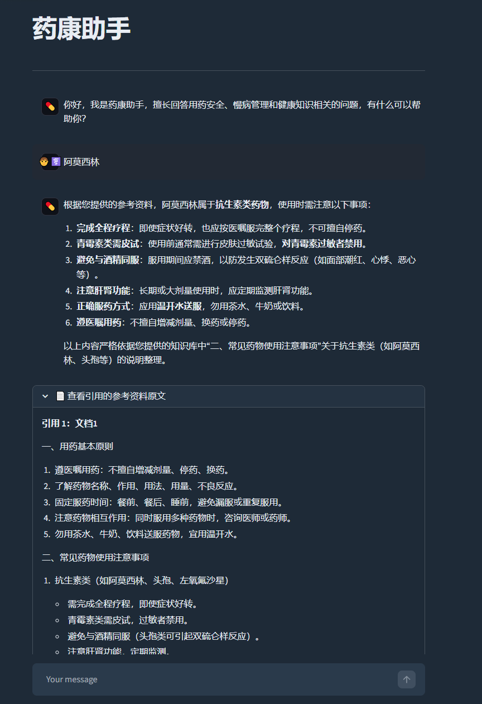
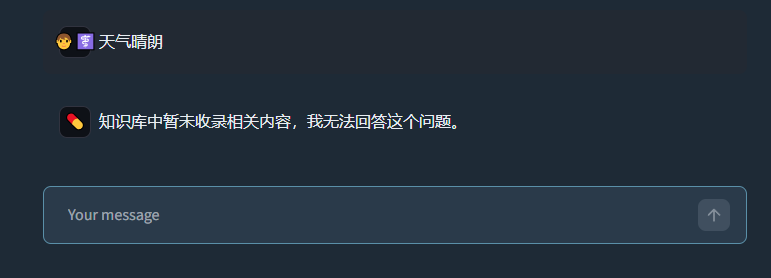
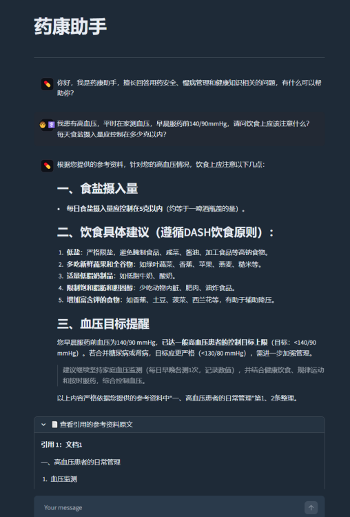

# 🏥 药康助手 — 医疗知识库 RAG 问答系统

基于 **LangChain + Chroma + 通义千问** 构建的医疗领域检索增强生成（RAG）问答系统，支持混合检索、流式对话与引用溯源。本项目基于开源 RAG 项目进行学习、核心链路重新实现及二次开发，面向用药安全、慢病管理等医疗知识问答场景。

---

## 项目背景

医疗知识具有专业性强、术语密集、知识依据要求严格的特点。通用大模型在面对药品名称、疾病诊断、用药禁忌等问题时，容易产生幻觉或给出缺乏依据的回答。本项目通过 RAG 架构将大模型生成能力约束在本地知识库范围内，结合向量语义检索与 BM25 关键词检索，在回答专业问题的同时提供可追溯的参考资料来源。

---

## ✨ 功能特性

| 特性 | 说明 |
|------|------|
| 🔍 **混合检索** | 向量语义检索（Chroma）+ BM25 关键词检索（jieba 中文分词），权重 6:4 |
| 💬 **流式对话** | 支持打字机效果的流式输出，提升交互体验 |
| 📚 **知识库管理** | 支持批量上传 TXT 文件，自动去重（MD5），自动分块入库 |
| 🧠 **对话记忆** | 基于本地 JSON 文件的对话历史持久化，支持多轮上下文 |
| 📄 **引用溯源** | 回答下方可展开查看引用的参考资料原文及来源 |
| 🔒 **安全约束** | 严格基于知识库回答，无相关知识时明确拒绝回答 |

---

## 📁 项目结构

```
.
├── settings.py          # 全局配置（模型、分块参数、检索阈值等）
├── chat_main.py         # Streamlit 主页面 — 问答对话
├── chat_upload.py       # Streamlit 子页面 — 知识库文件上传
├── qa_engine.py         # RAG 问答引擎（Prompt 构建、检索链、对话链）
├── Index_manager.py     # 索引管理（混合检索器、BM25 懒加载）
├── db_service.py        # 知识库服务（文本入库、MD5 去重、Chroma 操作）
├── chat_memory.py       # 本地 JSON 对话历史存储
├── log_config.py        # 日志配置（标准库 logging）
└── requirements.txt     # Python 依赖配置
```

---

## 🏗️ 技术架构

```
┌─────────────────┐     ┌─────────────────┐
│  Streamlit UI   │────▶│  chat_main.py   │  问答界面
│  (chat_upload)  │────▶│ chat_upload.py  │  上传界面
└─────────────────┘     └────────┬────────┘
                                 │
                    ┌────────────┴────────────┐
                    │      QAService          │
                    │  (qa_engine.py)         │
                    │  · Prompt 模板构建       │
                    │  · RunnableWithMessageHistory │
                    └────────────┬────────────┘
                                 │
              ┌──────────────────┼──────────────────┐
              ▼                  ▼                  ▼
      ┌──────────────┐  ┌──────────────┐  ┌──────────────┐
      │ 向量检索器    │  │ BM25检索器   │  │ 对话历史     │
      │ (Chroma)     │  │ (jieba分词)  │  │ (Local JSON) │
      └──────────────┘  └──────────────┘  └──────────────┘
              │                  │
              └────────┬─────────┘
                       ▼
              ┌────────────────┐
              │ EnsembleRetriever│  混合检索，Top-K 合并
              └────────────────┘
                       │
              ┌────────┴────────┐
              ▼                 ▼
      ┌──────────────┐  ┌──────────────┐
      │ DashScope    │  │ ChatTongyi   │
      │ Embeddings   │  │ (qwen3-max)  │
      └──────────────┘  └──────────────┘
```

**核心链路**：用户问题 → Embedding → Chroma 向量检索 + BM25 → EnsembleRetriever → Top-K → Prompt → 通义千问 → 回答 + 引用来源

---

## 🔍 检索方案与参数实验

### 1. 为什么使用 BM25

医疗知识库中存在大量疾病名称、药品名称和专业术语（如"阿莫西林"、"双硫仑样反应"）。单纯依赖向量检索时，检索结果主要依据语义相似度，对于疾病名称、药品名称及专业术语等精确字面匹配的敏感性相对有限；而用户提问时往往会直接使用这些专业关键词。因此引入 BM25 中文关键词检索（基于 jieba 分词）与 Chroma 向量检索形成互补，最终通过 EnsembleRetriever 做 Hybrid Search。

### 2. Chunk 参数实验

使用两组典型 Query 进行观察：
- **Query 1（口语化/语义）**："我最近总是头晕眼花，浑身没劲，该注意什么？"
- **Query 2（专业术语/字面）**："阿莫西林和酒精反应"

| 阶段 | 参数 | 块数 | 观察结果                                                            |
|------|------|------|-----------------------------------------------------------------|
| 阶段一 | chunk_size=300, overlap=20 | ~16 | BM25 出现大量 0 分（术语被切碎）；向量检索出现负数，语义漂移严重（如匹配到"烟酒嗜好"）                |
| 阶段二 | chunk_size=512, overlap=100 | ~10 | BM25 恢复正分，术语完整性改善；向量检索稳定召回相关内容；但受限于语料规模小，BM25 对不同 Query 的排序区分能力有限 |
| 阶段三 | chunk_size=1000, overlap=100 | ~5 | 块过大导致高频词（如"用药"、"原则"）覆盖范围扩大，BM25 区分度下降；向量检索混入更多背景内容，相似度分数降低      |

**观察总结**：
- 块太小（300/20）会切碎专业术语，导致 BM25 词频失效，同时向量检索因上下文过短出现语义漂移；
- 块太大（1000/100）会让高频词稀释 IDF，BM25 失去区分度，向量检索也引入过多无关背景；
- 在当前测试数据和 Query 下，**512/100 表现相对均衡**，overlap 对保护术语完整性有明显作用；
- 由于当前知识库仅含少量源文档，BM25 的 IDF 统计意义有限，上述结论仅代表当前数据规模下的参数趋势。

### 3. Vector Search、BM25、Hybrid Search 对比

| 检索方式 | 优势场景 | 本项目中的角色 |
|----------|----------|----------------|
| Vector Search | 口语化表达、同义改写、语义相似问题 | 主检索通道，召回语义相关片段 |
| BM25 | 疾病/药品名称、专业术语等精确关键词匹配 | 辅助检索通道，补充字面匹配能力 |
| Hybrid Search (6:4) | 两者互补，兼顾语义与关键词 | 当前方案，通过 EnsembleRetriever 融合排序 |

### 4. 实验局限

- 当前测试数据量较小（少量源文档，5~16 个 Chunk），不足以产生统计学意义的最优参数；
- 上述实验用于验证参数趋势和检索方案可行性，不代表大规模医疗知识库上的普遍最优结果；
- 后续可扩充数据集，并引入 Recall@K、MRR、Hit Rate 等指标进行量化评估。

---

## 🖼️ 效果展示

### 1. 智能问答与引用溯源

输入用药相关问题，系统自动检索知识库并生成结构化回答，支持展开查看引用的参考资料原文。



### 2. 安全约束 — 知识库未收录时明确拒绝

当问题超出知识库范围时，系统严格遵守 Prompt 约束，明确拒绝回答，避免幻觉。



### 3. 慢病管理详细建议

针对高血压等慢病问题，系统基于知识库提供结构化的饮食、监测、用药建议。



---

## 🚀 快速开始

### 1. 环境准备

```bash
# Python 3.9+
pip install -r requirements.txt
```

### 2. 配置环境变量

在项目根目录创建 `.env` 文件：

```env
DASHSCOPE_API_KEY=your_dashscope_api_key_here
```

> 系统使用 DashScope 提供的 `text-embedding-v4` 嵌入模型和 `qwen3-max` 大模型。

### 3. 启动服务

```bash
# 启动问答页面（主页面）
streamlit run chat_main.py

# 启动知识库上传页面
streamlit run chat_upload.py
```

---

## 📦 依赖环境

### 核心依赖清单

| 依赖包 | 版本约束 | 被引用位置 | 说明 |
|--------|----------|-----------|------|
| `streamlit` | `>=1.35.0,<1.40.0` | `chat_main.py`, `chat_upload.py`, `Index_manager.py` | Web 界面与缓存机制 |
| `langchain` | `>=0.1.20,<0.2.0` | `Index_manager.py` (`EnsembleRetriever`) | 混合检索器主包 |
| `langchain-core` | `>=0.1.52,<0.2.0` | `chat_memory.py`, `qa_engine.py`, `Index_manager.py` | 消息历史、链结构、Prompt |
| `langchain-community` | `>=0.0.38,<0.1.0` | `db_service.py`, `qa_engine.py`, `Index_manager.py` | 通义千问模型与 DashScope 嵌入封装 |
| `langchain-chroma` | `>=0.1.2` | `db_service.py`, `Index_manager.py` | Chroma 向量库集成 |
| `langchain-text-splitters` | `>=0.0.2` | `db_service.py` | 递归文本分割器 |
| `jieba` | `>=0.42.1` | `Index_manager.py` | BM25 中文分词 |
| `python-dotenv` | `>=1.0.1` | `chat_main.py`, `chat_upload.py` | 环境变量加载 |
| `chromadb` | `>=0.4.24,<0.5.0` | 间接依赖 | 向量数据库持久化 |
| `dashscope` | `>=1.20.0` | 间接依赖 | 阿里云 SDK，大模型与嵌入底层调用 |
| `numpy` | `>=1.24.0,<2.0.0` | 间接依赖 | 向量运算基础 |

### requirements.txt

```txt
# ===================== 核心必装依赖 =====================
streamlit>=1.35.0,<1.40.0
python-dotenv>=1.0.1
jieba>=0.42.1

# ===================== LangChain 生态 =====================
langchain>=0.1.20,<0.2.0
langchain-core>=0.1.52,<0.2.0
langchain-community>=0.0.38,<0.1.0
langchain-chroma>=0.1.2
langchain-text-splitters>=0.0.2

# ===================== 向量数据库与模型底层 =====================
chromadb>=0.4.24,<0.5.0
numpy>=1.24.0,<2.0.0
dashscope>=1.20.0

# ===================== 网络与数据校验（间接依赖） =====================
aiohttp>=3.9.0
requests>=2.31.0
urllib3>=2.0.7,<3.0.0
pydantic>=2.5.0,<3.0.0
tiktoken>=0.6.0

# ===================== 可选扩展依赖（后续功能预留） =====================
# pillow>=10.2.0
# tqdm>=4.66.0
# pypdf>=4.0.0
# python-docx>=1.1.0
# openpyxl>=3.1.2
# markdown>=3.5.2
# loguru>=0.7.2
```

### 依赖引用关系

```
代码文件                直接引用的第三方包
─────────────────────────────────────────────────────────
chat_main.py    ──▶  streamlit, python-dotenv (dotenv)
chat_upload.py  ──▶  streamlit, python-dotenv (dotenv)
chat_memory.py  ──▶  langchain-core
db_service.py   ──▶  langchain-chroma, langchain-community,
                     langchain-text-splitters
Index_manager.py──▶  langchain-chroma, langchain (EnsembleRetriever),
                     langchain-community, langchain-core,
                     streamlit, jieba
qa_engine.py    ──▶  langchain-core, langchain-community
log_config.py   ──▶  (标准库 logging，无第三方)
```

---

## ⚙️ 核心配置（settings.py）

| 配置项 | 默认值                                                     | 说明 |
|--------|---------------------------------------------------------|------|
| `md5_path` | `"md5.text"`                                            | 已处理文件 MD5 记录文件 |
| `collection_name` | `"rag"`                                                 | Chroma 集合名称 |
| `persist_directory` | `"./chroma_db"`                                         | 向量数据库持久化目录 |
| `chunk_size` | `512`                                                   | 文本分块大小 |
| `chunk_overlap` | `100`                                                   | 分块重叠长度 |
| `separators` | `["\n\n", "\n", ".", "!", "?", "。", "！", "？", " ", ""]` | 文本分割分隔符 |
| `max_spliter_char_number` | `512`                                                   | 触发文本分割的字符阈值 |
| `similarity_threshold` | `3`                                                     | 检索返回文档数量（Top-K） |
| `embedding_model_name` | `"text-embedding-v4"`                                   | 嵌入模型 |
| `chat_model_name` | `"qwen3-max"`                                           | 对话大模型 |
| `session_config` | `{"configurable": {"session_id": "user_001"}}`          | 会话配置 |

> **注**：当前代码默认配置为 `chunk_size=1000, chunk_overlap=100`。在本地参数实验中，针对当前小规模测试数据观察到的趋势是 `512/100` 相对更均衡（详见「检索方案与参数实验」章节）。后续随着知识库扩充，可重新评估并调整默认参数。

---

## 📖 使用说明

### 知识库上传
1. 运行 `streamlit run chat_upload.py`
2. 拖拽或选择多个 **UTF-8 编码的 TXT 文件**
3. 系统自动完成：MD5 去重 → 文本分块 → 向量入库 → BM25 索引构建

### 问答对话
1. 运行 `streamlit run chat_main.py`
2. 在输入框中提问（如用药安全、慢病管理相关问题）
3. 系统会：
   - 通过混合检索召回相关文档片段
   - 基于参考资料生成回答
   - 支持点击「📄 查看引用的参考资料原文」查看来源

### 对话历史
- 对话历史按 `session_id` 隔离存储在 `chat_history/` 目录下的 JSON 文件中
- 可在 `settings.py` 中修改 `session_config` 切换会话

---

## 🔒 安全与约束机制

系统通过 **System Prompt** 严格约束模型行为，回答必须完全基于检索到的参考资料：

> 你是一个严格基于知识库回答的助手。  
> 你的回答必须完全基于下面提供的【检索到的参考资料】。  
> 如果参考资料为空，或者参考资料中没有任何与用户问题相关的信息，  
> 你必须直接回答：'知识库中暂未收录相关内容，我无法回答这个问题。'  
> 禁止使用你自身的知识或常识来补充回答。

该机制确保医疗场景下的回答有明确依据，知识库无相关内容时主动拒答，避免模型幻觉风险。当回答中包含上述提示语时，引用面板将自动折叠不显示。

---

## 📝 日志说明

日志文件按天存储在 `logs/` 目录下，格式为 `app_YYYYMMDD.log`。

- **文件日志**：DEBUG 级别，记录完整运行细节
- **控制台日志**：INFO 级别，避免刷屏

日志配置位于 `log_config.py`，使用 Python 标准库 `logging` 实现。

---

## ⚠️ 注意事项

1. **编码要求**：上传文件必须为 **UTF-8** 编码，否则会上传失败
2. **API Key**：确保已配置有效的 `DASHSCOPE_API_KEY`，否则嵌入和对话功能无法使用
3. **首次启动**：BM25 索引采用懒加载策略，首次调用检索时会自动构建，如有大量文档可能需要等待几秒
4. **MD5 去重**：相同内容的文件不会重复入库，去重记录保存在 `md5.text` 中
5. **模型依赖**：当前实现深度依赖阿里云 DashScope 服务，如需更换模型需修改 `qa_engine.py` 和 `db_service.py`

---

## 📄 License

MIT License

---

## 📝 本次修改清单

| 修改项 | 说明 |
|--------|------|
| 项目标题下方 | 新增一句话项目来源说明（基于开源项目学习、核心链路重新实现及二次开发） |
| 新增「项目背景」 | 在功能特性前增加，简短说明医疗场景为什么需要 RAG，控制在一小段 |
| 「技术架构」 | 保留原架构图，下方新增一行核心链路文字说明 |
| 新增「🔍 检索方案与参数实验」 | 位于技术架构与效果展示之间，包含：BM25 设计原因、Chunk 参数实验表格与总结、三种检索方式对比、实验局限声明 |
| 「核心配置」 | 将 chunk_size 改回与代码一致的 `1000`，chunk_overlap 改回 `100`，并新增注释说明实验观察到的 512/100 趋势 |
| 「安全与约束机制」 | 适度加强表述，强调"医疗场景下回答有明确依据、知识库无相关内容时主动拒答" |
| 整体措辞 | 调整部分语句，突出"实际实验"和"设计思考"，避免教程感 |
